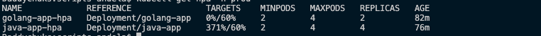
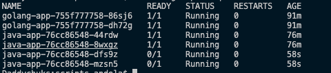

# Traffic Distribution Kubernetes Deployment

This is a kubernetes deployment that distributes traffic in a weighted manner across an application written in two languages (Golang and Java). The below technologies are used in this deployment:

## K8s Requirements / Technologies

- Minikube: Install a local copy of minikube (v1.17+) to spin up a 1 node cluster
- Docker
- Helm v3
- NGINX Ingress Controller

## Deployment Steps

1. Download the above requirements to your local computer except NGINX Ingress Controller
2. Build the Docker image for [Java](docker/java/Dockerfile) and [Golang](docker/golang/Dockerfile) applications located in the *docker* directory
3. Update the [golang](deployments/golang.yaml) and [java](deployments/java.yaml) values file in the *deployment* directory, set the respective image repo and tag.
4. Spin up a one node Minikube cluster `minikube start --cpus 4 --memory 4096`
5. Enable metrics-server addon > `minikube addons enable metrics-server`
6. Open up a terminal from your PC into directory root path and navigate to the *scripts* directory
7. Execute the commands below

 ```bash
    chmod +x ./apply.sh
    ./apply.sh
 ```

Executing the above command will perform the following task:

- Make *apply.sh* script executable
- Update helm repositories
- install the NGINX ingress controller repository
- Deploy Golang and Java applications to *prod* namespace of the minikube cluster

8. After the above command is done executing, open another terminal and execute the command `minikube tunnel`. The tunnel command is used to create a route to all services deployed with LoadBalancer type.
9. Get the IP of the NGINX loadbalancer by executing the command `kubectl get svc`
10. Modify the hosts file on your computer that allows you to map hostnames to IP addresses. Map the LoadBalancer IP to *app.hotel.com*
11. Access the running application on your browser via <http://app.hotel.com>

## Traffic Distribution

From the setup and deployment, traffic is distributed in the below manner:

- 70% of the requests are going to the application written in Go
- 30% of the requests are going to the application written in Java.

## Autoscaling

For autoscaling, the HorizontalPodAutoscaler also was configured for all apps which makes use of the resources limits and request settings. A busybox pod was applied to the cluster and used to generate traffic to the /hotels endpoint of the application using apache benchmark tool, and the below images shows the autoscaling effect:

- Load test: 100000 requests, with a maximum of 100 requests running concurrently to Java App:



## Cleanup

- Run the below command to remove helm releases:

    ```bash
    chmod +x ./delete.sh
    ./delete.sh
    ```

- Delete minikube cluster: `minikube delete`
